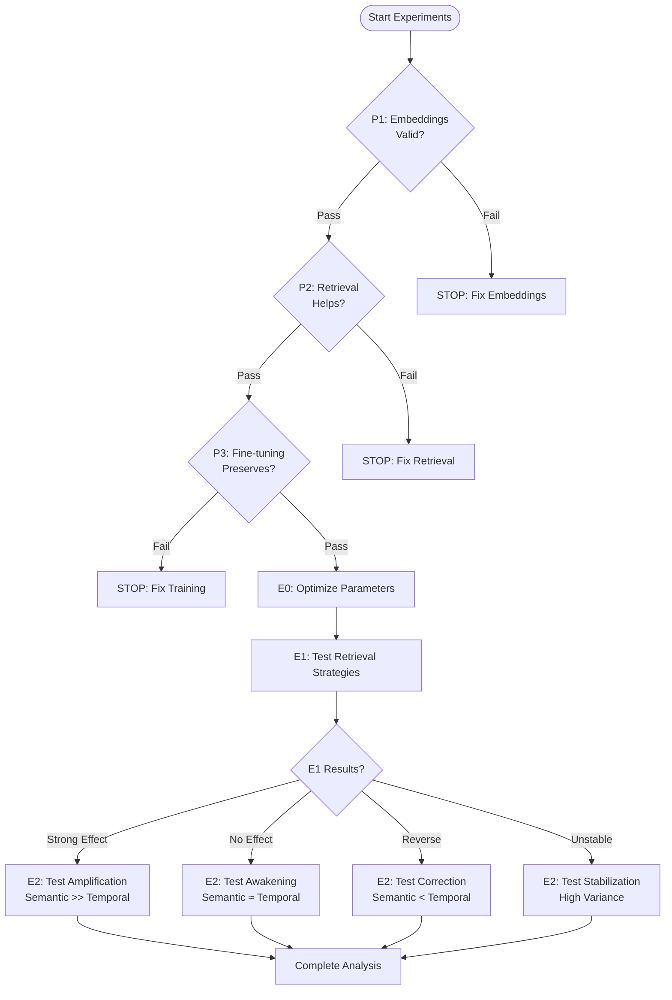

# Experiment Execution Flowchart

## Overview
This document provides the complete execution order and decision tree for all experiments leading to E2 (main experiment on fine-tuning for intuition).

## Experiment Dependency Graph

```
┌─────────────────────────────────────────────────────────────┐
│                    CRITICAL PREREQUISITES                    │
│                     Total Time: 10 hours                     │
├─────────────────────────────────────────────────────────────┤
│                                                              │
│  ┌──────────────┐  ┌──────────────┐  ┌──────────────┐     │
│  │     P1:      │  │     P2:      │  │     P3:      │     │
│  │  Embedding   │→ │  Retrieval   │→ │ Fine-tuning  │     │
│  │  Validity    │  │   Utility    │  │ Preservation │     │
│  │   (3 hrs)    │  │   (4 hrs)    │  │   (3 hrs)    │     │
│  └──────────────┘  └──────────────┘  └──────────────┘     │
│        │                 │                  │                │
│        └─────────────────┴──────────────────┘                │
│                          │                                   │
│                    ALL MUST PASS                             │
│                          ↓                                   │
└─────────────────────────────────────────────────────────────┘
                           │
                           ↓
┌─────────────────────────────────────────────────────────────┐
│                 E0: PARAMETER OPTIMIZATION                   │
│                      Total Time: 1 day                       │
├─────────────────────────────────────────────────────────────┤
│                                                              │
│   ┌─────────────────────────────────────────────────┐      │
│   │  Grid Search: Embedding weights, retrieval count │      │
│   │  Output: Optimal parameters for E1               │      │
│   └─────────────────────────────────────────────────┘      │
│                           ↓                                  │
└─────────────────────────────────────────────────────────────┘
                           │
                           ↓
┌─────────────────────────────────────────────────────────────┐
│              E1: MEMORY RETRIEVAL STRATEGIES                 │
│                    Total Time: 2 days                        │
├─────────────────────────────────────────────────────────────┤
│                                                              │
│   Test 3 conditions:                                         │
│   • No Memory (baseline)                                     │
│   • Temporal Retrieval                                       │
│   • Semantic Retrieval                                       │
│                                                              │
│   Output determines E2 hypothesis:                           │
│   ┌───────────────────┬─────────────────────────┐          │
│   │ Semantic >> Temp  │ → E2: Amplification     │          │
│   │ Semantic ≈ Temp   │ → E2: Awakening         │          │
│   │ Semantic < Temp   │ → E2: Correction        │          │
│   │ High Variance     │ → E2: Stabilization     │          │
│   └───────────────────┴─────────────────────────┘          │
│                           ↓                                  │
└─────────────────────────────────────────────────────────────┘
                           │
                           ↓
┌─────────────────────────────────────────────────────────────┐
│         E2: FINE-TUNING FOR INTUITION (MAIN)                │
│                    Total Time: 3 days                        │
├─────────────────────────────────────────────────────────────┤
│                                                              │
│   Hypothesis adapted based on E1 results                     │
│   Test conditions vary by scenario                           │
│   Final output: Does fine-tuning improve RAG usage?         │
│                                                              │
└─────────────────────────────────────────────────────────────┘
```

## Detailed Execution Timeline

### Day 0: Setup (4 hours)
- [ ] Install required packages (ollama, sqlite-vec, mlx, sentence-transformers)
- [ ] Verify compute resources (M2 Pro)
- [ ] Set up experiment tracking infrastructure
- [ ] Create data directories

### Day 1: Critical Prerequisites (10 hours)

#### Morning (3 hours)
**P1: Embedding Validity Test**
- Start: 9:00 AM
- End: 12:00 PM
- Decision Gate: Similarity ratio > 1.2
- Fail Action: STOP - Redesign similarity metric

#### Afternoon (7 hours)
**P2: Retrieval Utility Test**
- Start: 1:00 PM
- End: 5:00 PM
- Decision Gate: Any retrieval helps (p < 0.05)
- Fail Action: STOP - Investigate why

**P3: Fine-tuning Preservation Test**
- Start: 5:00 PM
- End: 8:00 PM
- Decision Gate: Retains >80% capabilities
- Fail Action: STOP - Adjust LoRA parameters

### Day 2: Parameter Optimization (8 hours)

**E0: Grid Search**
- Test embedding weight ratios
- Test retrieval counts (3, 5, 7, 10)
- Compare embedding models
- Output: Optimal configuration for E1

### Days 3-4: E1 Experiment (16 hours)

**Day 3: Data Generation & Setup**
- Generate 1,500 memory problems
- Generate 150 test problems
- Run baseline agent on memory set
- Create RAG database

**Day 4: Evaluation**
- Run three conditions × 150 problems × 3 seeds
- Statistical analysis
- Determine E2 hypothesis based on results

### Day 5: E2 Preparation (8 hours)

**Adaptive Design**
- Based on E1 results, choose E2 variant
- Generate training datasets (S and R)
- Prepare evaluation infrastructure

### Days 6-8: E2 Experiment (24 hours)

**Day 6: Fine-tuning**
- Train Model-S on summaries
- Train Model-R on raw logs
- Monitor convergence

**Day 7: Evaluation**
- Run all models on test set
- Collect comprehensive metrics

**Day 8: Analysis**
- Statistical tests
- Generate visualizations
- Write findings

## Decision Tree



## Critical Go/No-Go Gates

| Gate | Test | Pass Criteria | Fail Action | Time to Test |
|------|------|---------------|-------------|--------------|
| G1 | Embedding validity | Similarity ratio > 1.2 | Redesign metric | 3 hours |
| G2 | Retrieval utility | p < 0.05 vs no retrieval | Investigate | 4 hours |
| G3 | Fine-tuning preservation | >80% capability retained | Adjust params | 3 hours |
| G4 | E0 completion | Found optimal params | Use defaults | 8 hours |
| G5 | E1 completion | Clear results obtained | Proceed anyway | 16 hours |

## Resource Requirements by Phase

| Phase | Compute | Storage | Time | Critical Output |
|-------|---------|---------|------|-----------------|
| Prerequisites | M2 CPU only | 1 GB | 10 hrs | Go/No-go decision |
| E0 | M2 CPU only | 2 GB | 8 hrs | Optimal parameters |
| E1 | M2 CPU only | 5 GB | 16 hrs | E2 hypothesis selection |
| E2 | M2 GPU (Neural Engine) | 10 GB | 24 hrs | Final results |

## Risk Mitigation Schedule

| Risk | Probability | Impact | Mitigation | When to Implement |
|------|------------|---------|------------|-------------------|
| Embeddings fail | Low | Fatal | Test multiple models | P1 phase |
| Retrieval doesn't help | Low | Fatal | Check problem difficulty | P2 phase |
| Fine-tuning breaks model | Medium | Fatal | Use conservative params | P3 phase |
| E1 inconclusive | Medium | Delays | Increase sample size | After E1 |
| E2 training fails | Low | Major | Have backup configs | During E2 |

## Parallel Execution Opportunities

When possible, run in parallel:
- P1 and initial setup tasks
- Multiple embedding models in P1
- Grid search combinations in E0
- Different random seeds in E1/E2

## Output Artifacts by Experiment

| Experiment | Key Outputs | Format | Use in Next Phase |
|------------|-------------|---------|-------------------|
| P1-P3 | Pass/fail status | JSON logs | Gate for continuation |
| E0 | Optimal parameters | Config file | Settings for E1 |
| E1 | Performance metrics | CSV + plots | Hypothesis for E2 |
| E2 | Final results | Full report | Publication ready |